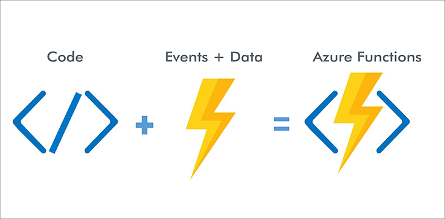
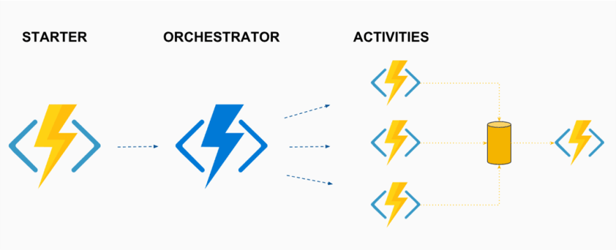

# Introduction and Goals

# Constraints

See shared documentation

# Context and Scope

See shared documentation

# Solution Strategy

Solution Strategy

# Building Block View

Building Block Overview

**Level 1** is the white box description of the overall system together
with black box descriptions of all contained building blocks.

**Level 2** zooms into some building blocks of level 1. Thus it contains
the white box description of selected building blocks of level 1,
together with black box descriptions of their internal building blocks.

**Level 3** zooms into selected building blocks of level 2, and so on.

See [Building Block View](https://docs.arc42.org/section-5/) in the
arc42 documentation.

## Whitebox Overall System {#_whitebox_overall_system}

Here you describe the decomposition of the overall system using the
following white box template. It contains

- an overview diagram

- a motivation for the decomposition

- black box descriptions of the contained building blocks. For these
  we offer you alternatives:

    - use *one* table for a short and pragmatic overview of all
      contained building blocks and their interfaces

    - use a list of black box descriptions of the building blocks
      according to the black box template (see below). Depending on
      your choice of tool this list could be sub-chapters (in text
      files), sub-pages (in a Wiki) or nested elements (in a modeling
      tool).

- (optional:) important interfaces, that are not explained in the
  black box templates of a building block, but are very important for
  understanding the white box. Since there are so many ways to specify
  interfaces why do not provide a specific template for them. In the
  worst case you have to specify and describe syntax, semantics,
  protocols, error handling, restrictions, versions, qualities,
  necessary compatibilities and many things more. In the best case you
  will get away with examples or simple signatures.

***\<Overview Diagram>***

Motivation

:   <text explanation>

Contained Building Blocks

:   <Description of contained building block (black boxes)>

Important Interfaces

:   <Description of important interfaces>

Insert your explanations of black boxes from level 1:

If you use tabular form you will only describe your black boxes with
name and responsibility according to the following schema:

| **Name**       | **Responsibility** |
|----------------|--------------------|
| <black box 1>* | <Text>             |
| <black box 2>* | <Text>             |

If you use a list of black box descriptions then you fill in a separate
black box template for every important building block . Its headline is
the name of the black box.

### \<Name black box 1>

Here you describe \<black box 1> according the the following black box
template:

- Purpose/Responsibility

- Interface(s), when they are not extracted as separate paragraphs.
  This interfaces may include qualities and performance
  characteristics.

- (Optional) Quality-/Performance characteristics of the black box,
  e.g.availability, run time behavior, ....

- (Optional) directory/file location

- (Optional) Fulfilled requirements (if you need traceability to
  requirements).

- (Optional) Open issues/problems/risks

*\<Purpose/Responsibility>*

*\<Interface(s)>*

*\<(Optional) Quality/Performance Characteristics>*

*\<(Optional) Directory/File Location>*

*\<(Optional) Fulfilled Requirements>*

*\<(optional) Open Issues/Problems/Risks>*

### \<Name black box 2>

*\<black box template>*

### \<Name black box n>

*\<black box template>*

### \<Name interface 1>

...

### \<Name interface m>

## Level 2 {#_level_2}

Here you can specify the inner structure of (some) building blocks from
level 1 as white boxes.

You have to decide which building blocks of your system are important
enough to justify such a detailed description. Please prefer relevance
over completeness. Specify important, surprising, risky, complex or
volatile building blocks. Leave out normal, simple, boring or
standardized parts of your system

### White Box *\<building block 1>*

...describes the internal structure of *building block 1*.

*\<white box template>*

### White Box *\<building block 2>*

*\<white box template>*

...

### White Box *\<building block m>*

*\<white box template>*

## Level 3

Here you can specify the inner structure of (some) building blocks from
level 2 as white boxes.

When you need more detailed levels of your architecture please copy this
part of arc42 for additional levels.

### White Box

Specifies the internal structure of *building block x.1*.

*\<white box template>*

### White Box

*\<white box template>*

### White Box

*\<white box template>*

# Runtime View

## Layers/Participants

* Storage Account Lane
* Doc Gen
* Doc Gen Admin

## Service Runtime View

* Storage Account Lane
  * Table Storage
  * Blob Storage
* Doc Gen
  * Get Client Id
  * Is Authorized Client?
  * Are files Valid?
  * Create Job
  * Add Or Update Job
  * Upload File
  * Publish Message
  * Call OnJobCreated Callback
  * Convert Job
  * Process Completed
* Doc Gen Admin
  * Get Client Id

## Successful Runtime View

Once the client is registered and files are valid, 
the job is created and published to the Message-Bus,
files are persisted to the Blob Storage and process is successfully completed.

## Error Runtime View

During the process operation, several types of dimensional errors occur due to the inadequate control of process parameters. 
In this case the process will fail and terminated.

* Errors and Exceptions Scenarios
  * Error may occur by validating the Client-Id
  * Error may occur by validating the files

### Error Runtime Operation and Administration

* Launch
  * The process will be launched as docker container and waiting for requests
* Start-up
  * The process will be start-up via REST API from clients and waiting for the response
* Stop
  * The process will be stopped once the request is done and trace all transaction on reporting service (not ready yet)

## State machines
    
There will be no state holding at all, the process will be completely stateless

# Deployment View

Deployment View

**Motivation**

Software does not run without hardware. This underlying infrastructure
can and will influence a system and/or some cross-cutting concepts.
Therefore, there is a need to know the infrastructure.

Maybe a highest level deployment diagram is already contained in section
3.2. as technical context with your own infrastructure as ONE black box.
In this section one can zoom into this black box using additional
deployment diagrams:

-   UML offers deployment diagrams to express that view. Use it,
    probably with nested diagrams, when your infrastructure is more
    complex.

-   When your (hardware) stakeholders prefer other kinds of diagrams
    rather than a deployment diagram, let them use any kind that is able
    to show nodes and channels of the infrastructure.

## Infrastructure Level 1

Describe (usually in a combination of diagrams, tables, and text):

-   distribution of a system to multiple locations, environments,
    computers, processors, .., as well as physical connections between
    them

-   important justifications or motivations for this deployment
    structure

-   quality and/or performance features of this infrastructure

-   mapping of software artifacts to elements of this infrastructure

For multiple environments or alternative deployments please copy and
adapt this section of arc42 for all relevant environments.

***\<Overview Diagram>***

Motivation

:   <explanation in text form>

Quality and/or Performance Features

:   <explanation in text form>

Mapping of Building Blocks to Infrastructure

:   <description of the mapping>

## Infrastructure Level 2

Here you can include the internal structure of (some) infrastructure
elements from level 1.

Please copy the structure from level 1 for each selected element.

### <Infrastructure Element 1>

<diagram + explanation>

### <Infrastructure Element 2>

<diagram + explanation>

...

### <Infrastructure Element n>

<diagram + explanation>

# Crosscutting Concepts

## Cost-Efficiency

## Azure Functions

## Durable Functions

**Contents**

Important, expensive, large scale or risky architecture decisions
including rationales. With \"decisions\" we mean selecting one
alternative based on given criteria.

Please use your judgement to decide whether an architectural decision
should be documented here in this central section or whether you better
document it locally (e.g. within the white box template of one building
block).

Avoid redundancy. Refer to other sections, where you already captured the
most important decisions of your architecture.

**Motivation**

Stakeholders of your system should be able to comprehend and retrace
your decisions.

Architecture Decisions                                                                                   |

# Quality Requirements

## Quality Tree

## Quality Scenarios

Quality Scenarios

# Risk and Technical Debt

## Development Risks

## Deployment Risks

## Operations Risks

# Glossary

| Term      | Definition    | 
|-----------|---------------| 
| DX        | Data Exchange | 
| Microtema | Micro tema    |

