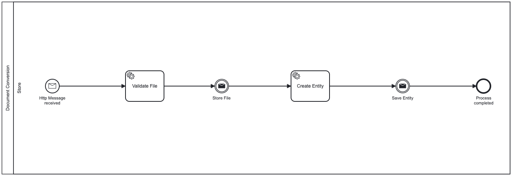

# Runtime View

## Layers/Participants

* Storage Account Lane
* Doc Gen
* Doc Gen Admin

## Service Runtime View

* Storage Account Lane
  * Table Storage
  * Blob Storage
* Doc Gen
  * Get Client Id
  * Is Authorized Client?
  * Are files Valid?
  * Create Job
  * Add Or Update Job
  * Upload File
  * Publish Message
  * Call OnJobCreated Callback
  * Convert Job
  * Process Completed
* Doc Gen Admin
  * Get Client Id

## Successful Runtime View

Once the client is registered and files are valid, 
the job is created and published to the Message-Bus,
files are persisted to the Blob Storage and process is successfully completed.

## Error Runtime View

During the process operation, several types of dimensional errors occur due to the inadequate control of process parameters. 
In this case the process will fail and terminated.

* Errors and Exceptions Scenarios
  * Error may occur by validating the Client-Id
  * Error may occur by validating the files

### Error Runtime Operation and Administration

* Launch
  * The process will be launched as docker container and waiting for requests
* Start-up
  * The process will be start-up via REST API from clients and waiting for the response
* Stop
  * The process will be stopped once the request is done and trace all transaction on reporting service (not ready yet)

## State machines
    
There will be no state holding at all, the process will be completely stateless